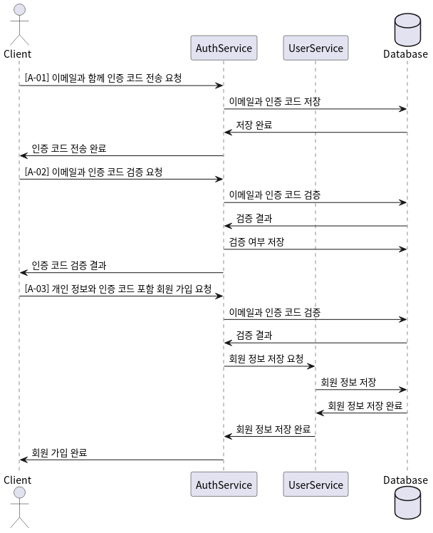
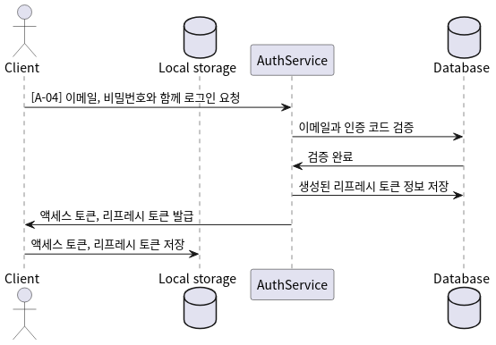
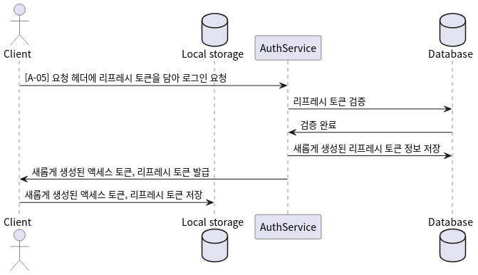
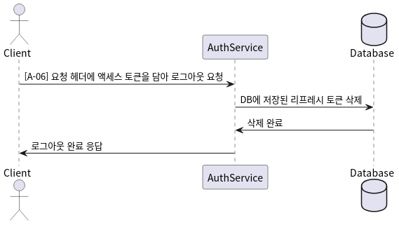

# API Documentation

이 문서는 SCS 프로젝트의 API 설계 문서이다.

## Auth

이 섹션은 인증 관련 API에 대한 설계이다.

| API ID | Method |               URI                | Summary        |
| :----: | :----: | :------------------------------: | :------------- |
|  A-01  |  POST  | /v1/auth/email/verification-code | 인증 코드 전송 |
|  A-02  |  POST  |    /v1/auth/email/verify-code    | 인증 코드 검증 |
|  A-03  |  POST  |         /v1/auth/signup          | 회원 가입      |
|  A-04  |  POST  |        /v1/auth/jwt/login        | 로그인         |
|  A-05  |  POST  |       /v1/auth/jwt/refresh       | 리프레시       |
|  A-06  |  POST  |       /v1/auth/jwt/logout        | 로그아웃       |

### A-01: 인증 코드 전송

- **Description**: `A-01`로 사용자 이메일에 인증 코드를 전송하고, `A-02`로 인증 코드를 검증한 후, `A-03`으로 회원 가입을 마무리한다.
- **Method**: `POST`
- **URI**: `/v1/auth/email/verification-code`
- **Request**: Body = { email: `user email` }
- **Response data**: { message: `result message` }

### A-02: 인증 코드 검증

- **Description**: `A-01`로 사용자 이메일에 인증 코드를 전송하고, `A-02`로 인증 코드를 검증한 후, `A-03`으로 회원 가입을 마무리한다.
- **Method**: `POST`
- **URI**: `/v1/auth/email/verify-code`
- **Request**: Body = { email: `user email`, verificationCode: `verification code` }
- **Response data**: { message: `result message` }

### A-03: 회원 가입

- **Description**: `A-01`로 사용자 이메일에 인증 코드를 전송하고, `A-02`로 인증 코드를 검증한 후, `A-03`으로 회원 가입을 마무리한다.
- **Method**: `POST`
- **URI**: `/v1/auth/signup`
- **Request**: Body = { email: `user email`, password: `user password`, nickname: `user nickname`, affiliation: `user's affiliation`, position: `user's position in the field`, verificationCode: `verified code` }
- **Response data**: { message: `result message`, user: `created user information with no password` }

### A-04: 로그인

- **Description**: 리프레시 토큰, 액세스 토큰을 사용한 JWT 기반의 방식으로 로그인한다.
- **Method**:`POST`
- **URI**: `/v1/auth/jwt/login`
- **Request**: Body = { email: `user email`, password: `user password` }
- **Response data**: { message: `result message`, accessToken: `JWT access token`, refreshToken: `JWT refresh token` }

### A-05: 리프레시

- **Description**: 리프레시 토큰을 사용해 액세스 토큰과 리프레시 토큰을 재발급한다.
- **Method**: `POST`
- **URI**: `/v1/auth/jwt/refresh`
- **Request**: Request header = { Authorization: `Bearer ${refreshToken}` }
- **Response data**: { message: `result message`, accessToken: `JWT access token`, refreshToken: `JWT refresh token` }

### A-06: 로그아웃

- **Description**: 데이터베이스에 저장된 리프레시 토큰 정보를 삭제한다.
- **Method**: `POST`
- **URI**: `/v1/auth/jwt/logout`
- **Request**: Request header = { Authorization: `Bearer ${accessToken}` }
- **Response data**: { message: `result message` }

### Appendix. 회원 가입 API 사용 절차

### Appendix. 사용자 인증 API 사용 절차

## User

이 섹션은 사용자 관련 API에 대한 설계이다.

| API ID | Method |        URI         | Summary                       |
| :----: | :----: | :----------------: | :---------------------------- |
|  U-01  |  GET   |     /v1/users      | 모든 사용자 정보 조회         |
|  U-02  |  GET   |   /v1/users/:id    | 특정 사용자 정보 조회         |
|  U-03  |  GET   |    /v1/users/me    | 로그인한 사용자 정보 조회     |
|  U-04  | PATCH  | /v1/users/password | 로그인한 사용자 비밀번호 변경 |
|  U-05  | PATCH  | /v1/users/nickname | 로그인한 사용자 닉네임 변경   |
|  U-06  | DELETE |     /v1/users      | 로그인한 사용자 회원 탈퇴     |

### U-01: 모든 사용자 정보 조회

- **Description**: 모든 사용자의 기본적인 정보를 조회한다.
- **Method**: `GET`
- **URI**: `/v1/users`
- **Request**: None
- **Response data**: { message: `result message`, users: [ { id: `user's id`, email: `user's email`, nickname: `user's nickname`, affiliation: `user's affiliation`, position: `position` }, { ... }, ... ] }

### U-02: 특정 사용자 정보 조회

- **Description**: 특정 사용자의 기본적인 정보를 조회한다.
- **Method**: `GET`
- **URI**: `/v1/users/:id`
- **Request**: URI 경로에 사용자의 ID를 전달한다.
- **Response data**: { message: `result message`, user: { id: `user's id`, email: `user's email`, nickname: `user's nickname`, affiliation: `user's affiliation`, position: `position` } }

### U-03: 로그인한 사용자 정보 조회

- **Description**: 로그인한 사용자의 기본적인 정보를 조회한다.
- **Method**: `GET`
- **URI**: `/v1/users/me`
- **Request**: Request header = { Authorization: `Bearer ${accessToken}` }
- **Response data**: { message: `result message`, user: { id: `user's id`, email: `user's email`, nickname: `user's nickname`, affiliation: `user's affiliation`, position: `position` } }

### U-04: 로그인한 사용자 비밀번호 변경

- **Description**: 로그인한 사용자의 비밀번호를 변경한다.
- **Method**: `PATCH`
- **URI**: `/v1/users/password`
- **Request**: Request header = { Authorization: `Bearer ${accessToken}` } & Body = { password: `current password`, newPassword: `new password`, confirmPassword: `new confirm password` }
- **Response data**: { message: `result message` }

### U-05: 로그인한 사용자 닉네임 변경

- **Description**: 로그인한 사용자의 닉네임을 변경한다.
- **Method**: `PATCH`
- **URI**: `/v1/users/nickname`
- **Request**: Request header = { Authorization: `Bearer ${accessToken}` } & Body = { nickname: `new nickname` }
- **Response data**: { message: `result message` }

### U-06: 로그인한 사용자 회원 탈퇴

- **Description**: 로그인한 사용자의 정보를 삭제한다.
- **Method**: `DELETE`
- **URI**: `/v1/users`
- **Request**: Request header = { Authorization: `Bearer ${accessToken}` } & Body = { password: `user's password`, confirmMessage: `회원 탈퇴를 희망합니다.` }
- **Response data**: { message: `result message` }

## Section

이 섹션은 섹션 관련 API에 대한 설계이다.

| API ID | Method |             URI              | Summary        |
| :----: | :----: | :--------------------------: | :------------- |
|  S-01  |  GET   |         /v1/sections         | 모든 섹션 조회 |
|  S-02  |  GET   |       /v1/sections/:id       | 특정 섹션 조회 |
|  S-03  |  POST  |         /v1/sections         | 새 섹션 생성   |
|  S-04  | PATCH  |   /v1/sections/:id/subject   | 섹션 제목 수정 |
|  S-05  | PATCH  | /v1/sections/:id/description | 섹션 설명 수정 |
|  S-06  | DELETE |       /v1/sections/:id       | 섹션 삭제      |

### S-01: 모든 섹션 조회

- **Description**: 모든 섹션의 기본 정보를 조회한다.
- **Method**: `GET`
- **URI**: `/v1/sections`
- **Request**: None
- **Response data**: { message: `result message`, sections: [ { id: `section's id`, subject: `section's subject`, creator: { id: `creator's id`, nickname: `creator's nickname` }, createdAt: `creation date`, questionCount: `number of questions` }, { ... }, ... ] }

### S-02: 특정 섹션 조회

- **Description**: 특정 섹션의 상세 정보를 조회한다.
- **Method**: `GET`
- **URI**: `/v1/sections/:id`
- **Request**: URI 경로에 섹션의 ID를 전달한다.
- **Response data**: { message: `result message`, section: { id: `section's id`, subject: `section's subject`, creator: { id: `creator's id`, nickname: `creator's nickname` }, createdAt: `creation date`, questions: [ { id: `question's id`, content: `question content`, writer: { id: `writer's id`, nickname: `writer's nickname` }, createdAt: `creation date` }, { ... }, ... ] } }

### S-03: 새 섹션 생성

- **Description**: 새로운 섹션을 생성한다. 관리자만 접근 가능하다.
- **Method**: `POST`
- **URI**: `/v1/sections`
- **Request**: Request header = { Authorization: `Bearer ${accessToken}` } & Body = { subject: `section's subject`, description: `section's description` }
- **Response data**: { message: `result message`, section: { id: `section's id`, subject: `section's subject`, creator: `creator's id`, createdAt: `creation date` } }

### S-04: 섹션 제목 수정

- **Description**: 특정 섹션의 제목을 수정한다. 관리자만 접근 가능하다.
- **Method**: `PATCH`
- **URI**: `/v1/sections/:id/subject`
- **Request**: Request header = { Authorization: `Bearer ${accessToken}` } & Body = { subject: `new section's subject` }
- **Response data**: { message: `result message`, section: { id: `section's id`, subject: `section's subject`, creator: { id: `creator's id`, nickname: `creator's nickname` }, createdAt: `creation date` } }

### S-05: 섹션 설명 수정

- **Description**: 특정 섹션의 설명을 수정한다. 관리자만 접근 가능하다.
- **Method**: `PATCH`
- **URI**: `/v1/sections/:id/description`
- **Request**: Request header = { Authorization: `Bearer ${accessToken}` } & Body = { description: `new section's description` }
- **Response data**: { message: `result message`, section: { id: `section's id`, subject: `section's subject`, creator: { id: `creator's id`, nickname: `creator's nickname` }, createdAt: `creation date` } }

### S-06: 섹션 삭제

- **Description**: 특정 섹션을 삭제한다. 관리자만 접근 가능하다.
- **Method**: `DELETE`
- **URI**: `/v1/sections/:id`
- **Request**: Request header = { Authorization: `Bearer ${accessToken}` }
- **Response data**: { message: `result message` }
