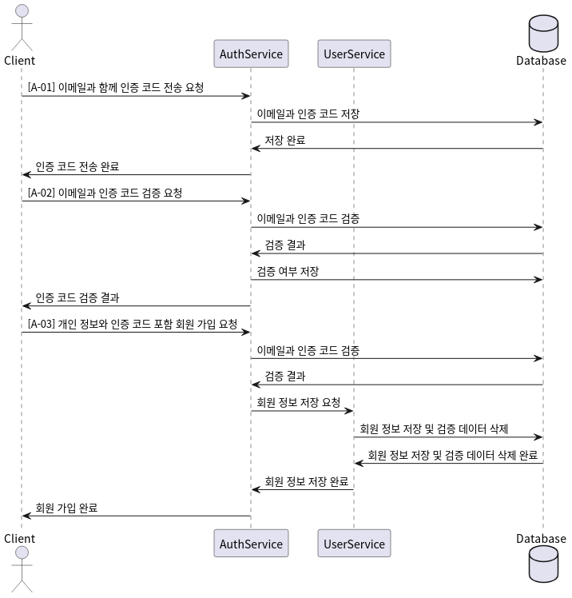

# API Documentation

이 문서는 SCS 프로젝트의 API 설계 문서이다.

## Auth

이 섹션은 인증 관련 API에 대한 설계이다.

| API ID | Method | URI | Summary |
| :--: | :--: | :--: | :-- |
| A-01 | POST | /auth/v1/email/verification-code | 인증 코드 전송 |
| A-02 | POST | /auth/v1/email/verify-code | 인증 코드 검증 |
| A-03 | POST | /auth/v1/signup | 회원 가입 |

### A-01: 인증 코드 전송

- **Description**: `A-01`로 사용자 이메일에 인증 코드를 전송하고, `A-02`로 인증 코드를 검증한 후, `A-03`으로 회원 가입을 마무리한다.
- **Method**: `POST`
- **URI**: `/auth/v1/email/verification-code`
- **Request**: Body = { email: `user email` }
- **Status code / Response**
  - 

### A-02: 인증 코드 검증

- **Description**: `A-01`로 사용자 이메일에 인증 코드를 전송하고, `A-02`로 인증 코드를 검증한 후, `A-03`으로 회원 가입을 마무리한다.
- **Method**: `POST`
- **URI**: `/auth/v1/email/verify-code`
- **Request**: Body = { email: `user email`, verificationCode: `verification code` }
- **Status code / Response**
  - 

### A-03: 회원 가입

- **Description**: `A-01`로 사용자 이메일에 인증 코드를 전송하고, `A-02`로 인증 코드를 검증한 후, `A-03`으로 회원 가입을 마무리한다.
- **Method**: `POST`
- **URI**: `/auth/v1/signup`
- **Request**: Body = { email: `user email`, password: `user password`, nickname: `user nickname`, affiliation: `user's affiliation`, position: `user's position in the field`, verificationCode: `verified code` }
- **Status code / Response**
  - 

### Appendix. 회원 가입 API 사용 절차

