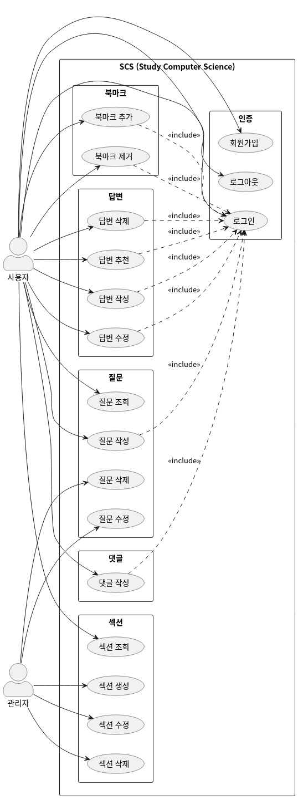

# SCS (Study Computer Science)

SCS는 컴퓨터 과학 전공 지식을 학습하기 위한 웹 서비스입니다. CS 분야별로 전공 지식에 대한 면접 질문과 그에 대한 답변을 커뮤니티 형태로 관리합니다.

## 프로젝트 구조

- `docs/`: SCS의 소프트웨어 설계 문서
- `frontend/`: SCS의 프론트엔드 프로젝트
- `backend/`: SCS의 백엔드 프로젝트

## 주요 기능

- 섹션별 질문 관리 (네트워크, 데이터베이스, 자바스크립트 등)
- 질문에 대한 다양한 답변 제공
- 답변에 대한 댓글 및 추천 기능
- 개인화된 학습 자료 생성 (Book 기능)

## 기술 스택

### 프론트엔드

- React
- TypeScript
- Vite

### 백엔드

- NestJS
- TypeORM
- PostgreSQL
- JWT 인증

### 공통

- Docker
- Docker-compose
- Git

## 현재 개발 현황

- [x] 사용자 인증 (Auth) 모듈 완성
- [x] 사용자 (User) 모듈 완성
- [x] 섹션 (Section) 모듈 완성
- [x] 질문 (Question) 모듈 완성
- [x] 업로드 (Upload) 모듈 완성
- [ ] 답변 (Action) 모듈 개발 중
- [ ] 댓글 (Comment) 모듈 예정
- [ ] 북 (Book) 모듈 예정
- [ ] 프론트엔드 개발 진행 중

## API 문서

현재 개발된 API에 대한 문서는 [여기](./Docs/API.md)에서 확인할 수 있습니다.

## Commit Message Rule

- 초기 커밋: Init
- 기능 추가: Feat
- 버그 수정: Fix
- 코드 리팩토링: Refactor
- 문서 업데이트: Docs
- 성능 개선: Perf
- 스타일 변경: Style
- 코드 제거: Remove
- 테스트 추가: Test
- 의존성 업데이트: Deps
- 데이터베이스 마이그레이션: DB
- 오타 수정: Typo

## 라이선스

이 프로젝트는 MIT 라이선스 하에 배포됩니다. 자세한 내용은 `LICENSE` 파일을 참조하세요.

## 연락처

프로젝트 관리자 - [@youth_1nn](https://www.instagram.com/youth_1nn/) - kys010306@sogang.ac.kr

프로젝트 링크: [https://github.com/Yush1nk1m/SCS](https://github.com/Yush1nk1m/SCS)
